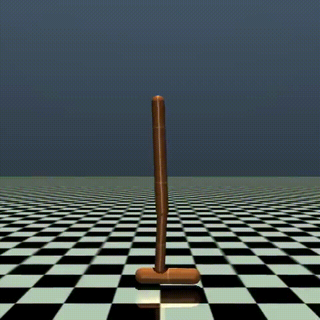
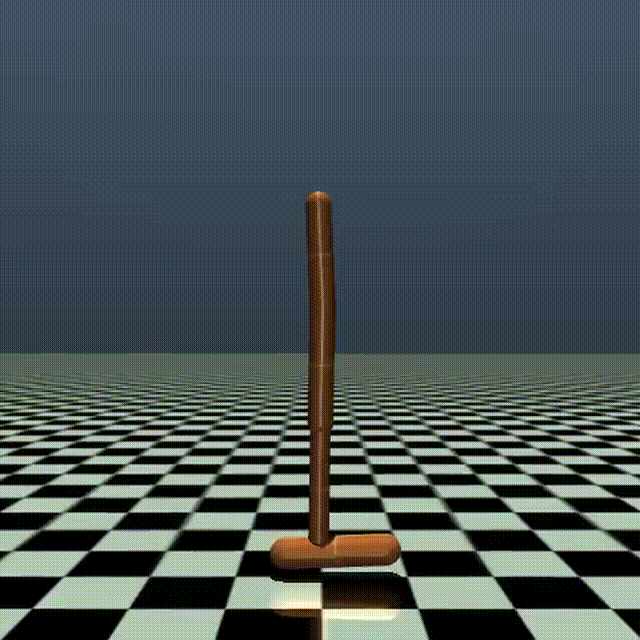
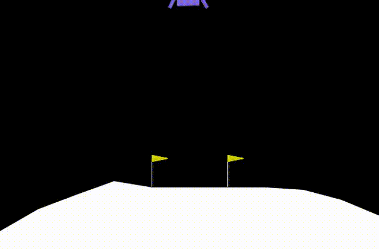

# Recursive Reward Aggregation (RRA)

Code for Recursive Reward Aggregation.
Built upon Stable-Baselines3.


## Videos for continuous control experiments

<div align="center">
  
  
  
  
  
  <br>
  &nbsp;&nbsp
  Hopper dsum &nbsp;&nbsp;&nbsp;&nbsp;&nbsp;&nbsp;&nbsp;&nbsp;&nbsp;&nbsp;&nbsp;&nbsp;&nbsp;&nbsp;&nbsp;&nbsp;&nbsp;&nbsp;&nbsp
  Hopper dmax &nbsp;&nbsp;&nbsp;&nbsp;&nbsp;&nbsp;&nbsp;&nbsp;&nbsp;&nbsp;&nbsp;&nbsp;&nbsp;&nbsp;&nbsp;&nbsp;&nbsp;&nbsp;&nbsp;&nbsp;&nbsp;&nbsp
  Hopper min &nbsp;&nbsp;&nbsp;&nbsp;&nbsp;&nbsp;&nbsp;&nbsp;&nbsp;&nbsp;&nbsp;&nbsp;&nbsp;&nbsp;&nbsp;&nbsp;&nbsp;&nbsp
  Hopper dsum + dmax &nbsp;&nbsp;&nbsp;&nbsp;&nbsp;&nbsp;&nbsp;&nbsp;&nbsp
  Hopper dsum - var
</div>


<div align="center">
  
  
  
  
  
  <br>
  &nbsp;&nbsp
  Ant dsum &nbsp;&nbsp;&nbsp;&nbsp;&nbsp;&nbsp;&nbsp;&nbsp;&nbsp;&nbsp;&nbsp;&nbsp;&nbsp;&nbsp;&nbsp;&nbsp;&nbsp;&nbsp;&nbsp;&nbsp;&nbsp;&nbsp;&nbsp;&nbsp;&nbsp;&nbsp;&nbsp;&nbsp;&nbsp
  Ant dmax &nbsp;&nbsp;&nbsp;&nbsp;&nbsp;&nbsp;&nbsp;&nbsp;&nbsp;&nbsp;&nbsp;&nbsp;&nbsp;&nbsp;&nbsp;&nbsp;&nbsp;&nbsp;&nbsp;&nbsp;&nbsp;&nbsp;&nbsp;&nbsp;&nbsp;&nbsp;&nbsp;&nbsp;&nbsp;&nbsp
  Ant min &nbsp;&nbsp;&nbsp;&nbsp;&nbsp;&nbsp;&nbsp;&nbsp;&nbsp;&nbsp;&nbsp;&nbsp;&nbsp;&nbsp;&nbsp;&nbsp;&nbsp;&nbsp;&nbsp;&nbsp;&nbsp;&nbsp;&nbsp;&nbsp
  Ant dsum + dmax &nbsp;&nbsp;&nbsp;&nbsp;&nbsp;&nbsp;&nbsp;&nbsp;&nbsp;&nbsp;&nbsp;&nbsp;&nbsp;&nbsp;&nbsp;&nbsp;&nbsp
  Ant dsum - var
</div>


<div align="center">
  
  
  
  
  
  <br>
  &nbsp;&nbsp
  Lunar dsum &nbsp;&nbsp;&nbsp;&nbsp;&nbsp;&nbsp;&nbsp;&nbsp;&nbsp;&nbsp;&nbsp;&nbsp;&nbsp;&nbsp;&nbsp;&nbsp;&nbsp;&nbsp;&nbsp;&nbsp;&nbsp;&nbsp;&nbsp;&nbsp
  Lunar dmax &nbsp;&nbsp;&nbsp;&nbsp;&nbsp;&nbsp;&nbsp;&nbsp;&nbsp;&nbsp;&nbsp;&nbsp;&nbsp;&nbsp;&nbsp;&nbsp;&nbsp;&nbsp;&nbsp;&nbsp;&nbsp;&nbsp;&nbsp;&nbsp;&nbsp
  Lunar min &nbsp;&nbsp;&nbsp;&nbsp;&nbsp;&nbsp;&nbsp;&nbsp;&nbsp;&nbsp;&nbsp;&nbsp;&nbsp;&nbsp;&nbsp;&nbsp;&nbsp;&nbsp;&nbsp;&nbsp
  Lunar dsum + dmax &nbsp;&nbsp;&nbsp;&nbsp;&nbsp;&nbsp;&nbsp;&nbsp;&nbsp;&nbsp;&nbsp;&nbsp;&nbsp;&nbsp
  Lunar dsum - var
</div>


## Running Experiments

### Gird-world environment
The `gird-world` environment can be executed directly using the Jupyter Notebook **`grid.ipynb`**.
```sh
cd grid
jupyter notebook grid.ipynb
```

### Wind environment
The `wind` environment can be executed directly using the Jupyter Notebook **`wind.ipynb`**.
```sh
cd wind
jupyter notebook wind.ipynb
```

### Continuous control experiment
```sh
cd continuous_control
./run_td3.sh
```

### Portfolio experiment
```sh
cd portfolio
./run_portfolio.sh
```


## Running with Docker
You can build and run the Docker container:
```sh
cd docker
docker build -t rra_image . -f Dockerfile 
```
### **Tips**
If you encounter issues with **Cython**, try the following:
```sh
pip uninstall Cython
pip install Cython==3.0.0a10
```
This can resolve version conflicts or compatibility issues with certain dependencies.
